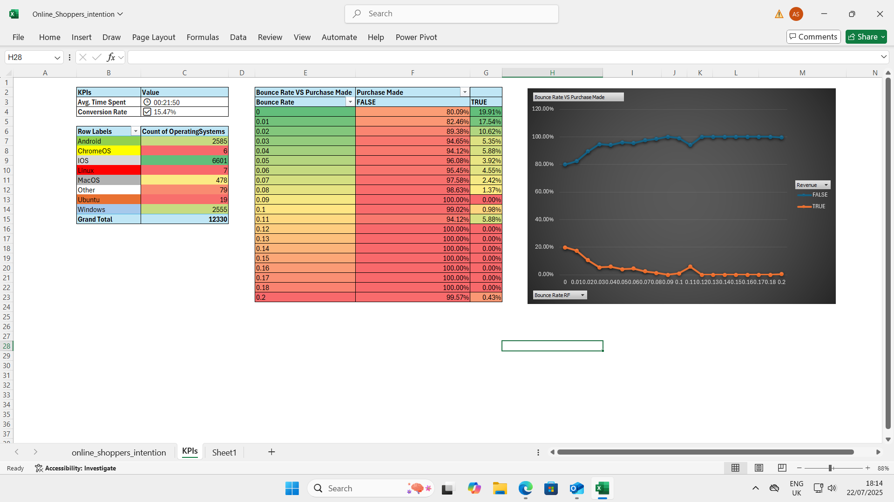

### 📊 Google AdSense Web Traffic Analysis (Excel)

Analyzed 12,000+ rows of Google AdSense traffic data to uncover user behavior and website performance using Excel tools like Power Query and PivotTables.

**🔍 Key Insights:**
- Conversion rate based on total visitors vs purchases
- Average session duration by user group
- Bounce rate vs. revenue correlation
- Visitor operating system distribution

**🧼 Data Cleaning:** Imported raw `.csv`, removed 400+ duplicates, assigned data types, cleaned time fields, and structured the dataset using Power Query.

**🛠️ Tools Used:** Excel, Power Query, PivotTables, Charts, Calculated Fields

📂 *Includes structured Excel file with visual breakdowns and metrics*

