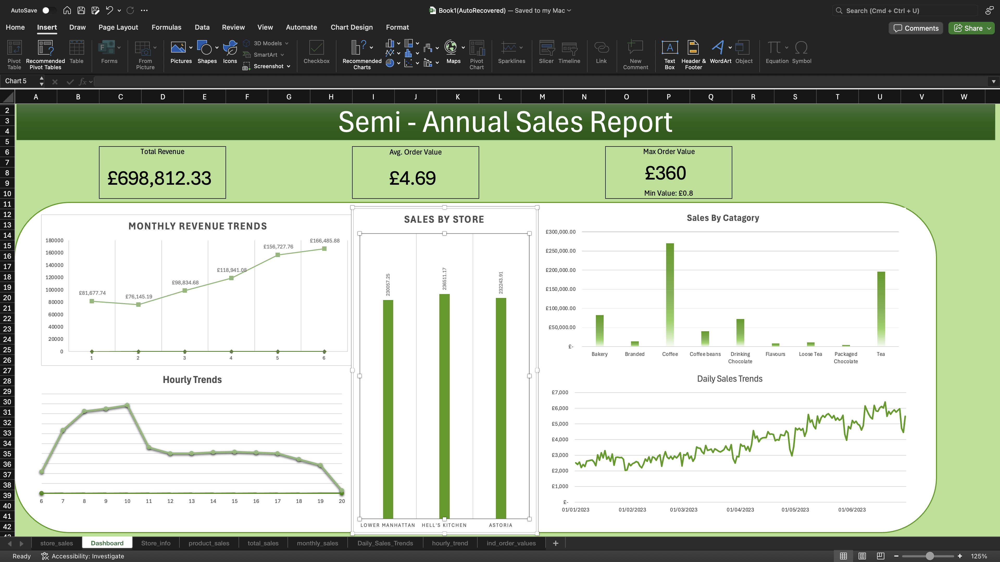

# MySQL Sales Analysis Project

## MySQL Actions
- Created a new schema and imported **149,116 transaction records**  
- Cleaned, standardized, and assigned appropriate data types  
- Performed **Exploratory Data Analysis (EDA)** to understand the dataset  
- Built SQL views to analyze:
  - Hourly, daily, monthly, and total sales trends  
  - Average, minimum, and maximum order values  
  - Best-selling and least-selling products, as well as sales trends by store  
- Exported processed data to **CSV** for further use  

## Excel Analysis & Dashboard
- Imported the cleaned dataset into Excel  
- Conducted additional trend analysis  
- Designed an interactive **dashboard** for visualization and insights  

## Key Findings
- All **3 stores** generated nearly equal sales  
- **Monthly sales** increased consistently from **January to June**, except for February  
- **7 AM – 10 AM** is the most critical time window for sales  
- **Coffee and Tea** are the top-performing categories, generating **£466,358** (~66.7% of total sales across 9 categories)  
- The **average order value** is **£4.69**  

